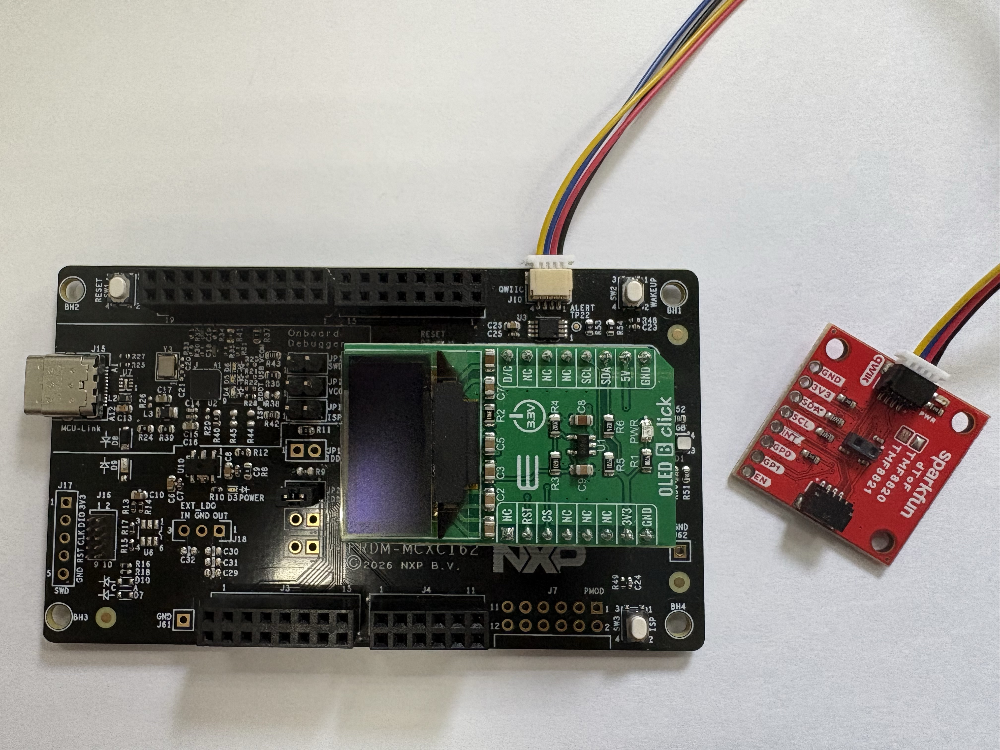
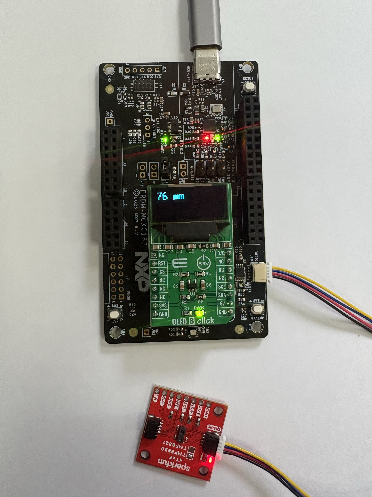

# NXP Application Code Hub
[](https://www.nxp.com)

## MCXC162 Low Power Presence Detection


This demo presents the low power presence detection on FRDM‑MCXC162 platform using a SparkFun Qwiic TMF8820 dToF sensor, DMA-assisted I2C transfers, and an OLED display.The application spends most of its time in a low-power state. It periodically wakes to poll the TMF8820 presence sensor through LPI2C + DMA. When presence is detected, the MCU transitions to active mode, captures measurement data, updates the OLED display. A push button can also trigger an asynchronous wake-up event.

<p align="left"></p>


#### Boards: FRDM-MCXC162
#### Categories: HMI
#### Peripherals: DMA, I2C
#### Toolchains: MCUXpresso IDE, VS code

## Table of Contents
1. [Software](#step1)
2. [Hardware](#step2)
3. [Setup](#step3)
4. [Results](#step4)
5. [FAQs](#step5) 
6. [Support](#step6)
7. [Release Notes](#step7)

## 1. Software<a name="step1"></a>
- Download and install [VS Code V1.133 or later](https://code.visualstudio.com/).
- Download MCUXpresso for VS Code Plugin 26.7.52 or later.
- Download MCU SDK: [SDK_26_06_00_FRDM-MCXC162](https://mcuxpresso.nxp.com/en/welcome) (Optional)

## 2. Hardware<a name="step2"></a>
- FRDM-MCXC162
- USB Type-C cable
### External Hardware

- SparkFun Qwiic dToF Imager (TMF8820)
- MikroE OLED B Click
- USB Type-C cable
- Host PC
- Qwiic cable

## 3. Setup<a name="step3"></a>
### 3.1 Import project from Application Code Hub
1. Open VS code, open MCUXpresso for VSCode extension.
2. In Quick Start Panel window click in Application Code Hub.
[<p align="left"></p>]()
3. In Search text field, type the name of this example "MCXC162 Low Power Presence Detection
4. Select the example, update the name and select the directory where the example will be saved.
5. Click on the import project and wait some minutes.
6. Add the toolchain: Arm GNU
7. Now you should have the “mcxc162-low-power-presence-detection” in your projects panel.
8. Download SparkFun_Qwiic_TMF882X_Arduino_Library from Github
[sparkfun/SparkFun_Qwiic_TMF882X_Arduino_Library: Arduino Library for SparkFun's Qwiic TMF882X breakout boards ](https://github.com/sparkfun/SparkFun_Qwiic_TMF882X_Arduino_Library)  
9. Copy following files into project dir TMF882X/  
These files are:  
```c
src/tmf882x_clock_correction.c    
src/tmf882x_interface.c  
src/tmf882x_interface.h
src/tmf882x_mode.c  
src/tmf882x_mode_app.c  
src/tmf882x_mode_bl.c  
src/tof_bin_image.c  
src/tof_bin_image.h  
src/tof_factory_cal.h  
src/intel_hex_interpreter.c  
src/mcu_tmf882x_config.h  
```

10. Then copying these files into TMF882X/inc  
These files are:  
```c
inc/intel_hex_interpreter.h  
inc/tmf8x2x_application_registers.h  
inc/tmf8x2x_config_page_common.h  
inc/tmf8x2x_config_page_factory.h  
inc/tmf8x2x_config_page_SPAD.h  
inc/tmf8x2x_electrical_calibration.h  
inc/tmf8x2x_histogram_registers.h  
inc/tmf8x2x_result_registers.h  
inc/tmf8x2x_statistic_registers.h  
inc/tmf882x.h  
inc/tmf882x_clock_correction.h  
inc/tmf882x_host_interface.h  
inc/tmf882x_mode.h  
inc/tmf882x_mode_app.h  
inc/tmf882x_mode_app_ioctl.h  
inc/tmf882x_mode_app_protocol.h  
inc/tmf882x_mode_bl.h  
```


11. Then modify tmf882x.h in the project，in line 45:
```c
#define TMF882X_MAX_MEAS_RESULTS 36
```

Modify to:
```c
#define TMF882X_MAX_MEAS_RESULTS 1
```

12. Then modify tmf882x_host_interface.h, in line 38
```c
#include "sfe_shim.h"
```

Modify to:
```c
#include <tof_driver_adapter.h>
```

13. In Project Files CMakeLists.txt, below the following text:
```c
add_executable(${MCUX_SDK_PROJECT_NAME}
```

You should add:
```c
"${ProjDirPath}/TMF882X/intel_hex_interpreter.c"
"${ProjDirPath}/TMF882X/mcu_tmf882x_config.h"
"${ProjDirPath}/TMF882X/tmf882x_clock_correction.c"
"${ProjDirPath}/TMF882X/tmf882x_interface.c"
"${ProjDirPath}/TMF882X/tmf882x_interface.h"
"${ProjDirPath}/TMF882X/tmf882x_mode.c"
"${ProjDirPath}/TMF882X/tmf882x_mode_app.c"
"${ProjDirPath}/TMF882X/tmf882x_mode_bl.c"
"${ProjDirPath}/TMF882X/tof_bin_image.c"
"${ProjDirPath}/TMF882X/tof_bin_image.h"
"${ProjDirPath}/TMF882X/tof_factory_cal.h"

"${ProjDirPath}/TMF882X/inc/intel_hex_interpreter.h"
"${ProjDirPath}/TMF882X/inc/tmf8x2x_application_registers.h"
"${ProjDirPath}/TMF882X/inc/tmf8x2x_config_page_common.h"
"${ProjDirPath}/TMF882X/inc/tmf8x2x_config_page_factory.h"
"${ProjDirPath}/TMF882X/inc/tmf8x2x_config_page_SPAD.h"
"${ProjDirPath}/TMF882X/inc/tmf8x2x_electrical_calibration.h"
"${ProjDirPath}/TMF882X/inc/tmf8x2x_histogram_registers.h"
"${ProjDirPath}/TMF882X/inc/tmf8x2x_result_registers.h"
"${ProjDirPath}/TMF882X/inc/tmf8x2x_statistic_registers.h"
"${ProjDirPath}/TMF882X/inc/tmf882x.h"
"${ProjDirPath}/TMF882X/inc/tmf882x_clock_correction.h"
"${ProjDirPath}/TMF882X/inc/tmf882x_host_interface.h"
"${ProjDirPath}/TMF882X/inc/tmf882x_mode.h"
"${ProjDirPath}/TMF882X/inc/tmf882x_mode_app.h"
"${ProjDirPath}/TMF882X/inc/tmf882x_mode_app_ioctl.h"
"${ProjDirPath}/TMF882X/inc/tmf882x_mode_app_protocol.h"
"${ProjDirPath}/TMF882X/inc/tmf882x_mode_bl.h"
```


### 3.2 Prepare FRDM board and Shield boards
1. Prepare SparkFun Qwiic dToF Imager (TMF8820) and plug into J10 on the board
2. Prepare MikroE click board OLED B Click and plug into the MikroE onboard socket J5 and J6
[<p align="left"></p>](./picture/setup.jpg)


### 3.3 Flash your FRDM board Application
1. Do right click on project "mcxc162-low-power-presence-detection" and select pristine build and wait about a one minute.
2. Click run (play icon).  
Note:If you are unable to find MCXC162 within your environment after clicking on "Run" or "Play" , please Go to MCUXpresso Installer and software to latest version specifically the Debug Probes, including Linkserver
3. Please wait a few seconds.
4. Now click stop in center upper button.

## 4. Results<a name="step4"></a>


### Low-Power Window (1–5 s)

- MCU enters low-power mode.
- Sensor is periodically polled.
- CPU activity remains minimal.

### Presence Detected

- Wake from low-power mode.
- Acquire sensor measurement.
- Update OLED display.

### Active Window (~100 ms)

- Measurement processed.
- OLED refreshed.
- Return to low-power mode.

### Manual Wake-Up

The button can wake the system at any time.

---

### Expected OLED Output

[<p align="left"></p>](./picture/running.jpg)


#### Project Metadata

<!----- Boards ----->
[]()

<!----- Categories ----->
[](https://mcuxpresso.nxp.com/appcodehub?category=hmi)

<!----- Peripherals ----->
[](https://mcuxpresso.nxp.com/appcodehub?peripheral=dma)
[](https://mcuxpresso.nxp.com/appcodehub?peripheral=i2c)

<!----- Toolchains ----->
[](https://mcuxpresso.nxp.com/appcodehub?toolchain=mcux)
[](https://mcuxpresso.nxp.com/appcodehub?toolchain=vscode)

Questions regarding the content/correctness of this example can be entered as Issues within this GitHub repository.

>**Note**: For more general technical questions regarding NXP Microcontrollers and the difference in expected functionality, enter your questions on the [NXP Community Forum](https://community.nxp.com/)

[](https://www.youtube.com/NXP_Semiconductors)
[](https://www.linkedin.com/company/nxp-semiconductors)
[](https://www.facebook.com/nxpsemi/)
[](https://x.com/NXP)

## 5. Release Notes<a name="step7"></a>
| Version | Description / Update                           | Date                        |
|:-------:|------------------------------------------------|----------------------------:|
| 1.0     | Initial release on Application Code Hub        | August 12<sup>th</sup> 2026 |